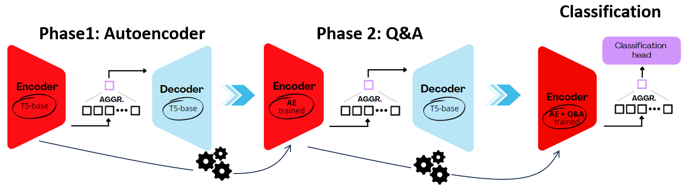

# PCAP_encoder

The idea of the project is to produce a representation of network traffic packets using:
- Question-answering on the mapping between raw network traffic and the its explanation (Wireshark style).
- A denoiser that reconstructs corrupted input packets.

At the end, the packet representation is evaluated on classification tasks. However, starting from the representation a lot of others tasks can be performed, such as novelty detection, etc.
<div style="text-align:center"></div>.


## Folder structure
The repository is organized into five main directories:
- **Datasets**:  Add your own datasets or use the provided examples here.
- **Core**: Houses the project's essential codebase including all classes and functions that power the application.
- **Experiments**: Contains ready-to-run experiment configurations (.sh files). To execute the PCAPencoder, navigate to this directory and select your desired experiment. Pre-trained model is available [here](https://drive.google.com/file/d/1j5ubI--9HflSFc_STpzFb9SHPmimvQiv/view?usp=share_link)
- **Training**: Contains the main.py code to run the question-answering, denoiser, and classification fine-tuning.
- **Preprocess**: Offers utilities for converting raw PCAP files into structured datasets suitable for PCAPencoder.

## Install
```
conda create -n <env> -f environment.yml
```

## We provide the shell file to run the experiments directly, please check the folder

## Citation
```
@phdthesis{dettori2024designing,
  title={Designing and engineering a Q\&A LLM for network packet representation},
  author={Dettori, Giovanni},
  year={2024},
  school={Politecnico di Torino}
}
```


